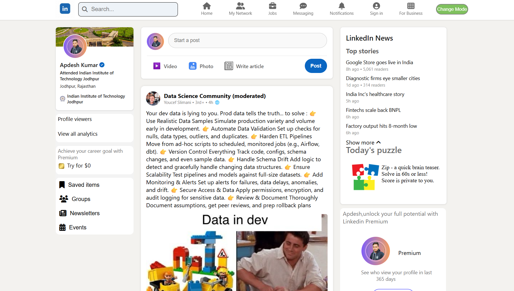

# Linkedine_clone_frontend_project

This is a **frontend clone of LinkedIn**, designed and built using **HTML**, **CSS**, and **JavaScript**. The project replicates LinkedIn's core layout and implements basic interactions like **sharing a post**, **liking posts**, and **responsive design** — giving you a realistic social media user interface.

---

## 📽️ Live Demo / Video Preview

(https://youtu.be/nWOYMPHaRZo?si=EQWp5QOumifnW6I-)

---

### 🔹 Home Page

---

## 🚀 Features

- 📝 **Share a Post Toggle**  
  - Click on "Start a post" area to open and close the post editor box.
  - Users can enter text (dummy input) and click on "Post" to simulate a post being shared.

- 👍 **Like Button with Counter**  
  - Clicking the like button increases the like count dynamically using JavaScript.
  - Button color changes to indicate it’s been liked.

- 💻 **Responsive Design**  
  - Works well on desktops, tablets, and mobile screens.

- 🧱 **UI Clone of LinkedIn**
  - Header bar, profile photo, post box, and newsfeed styled to resemble LinkedIn.
  - Built with clean and scalable CSS for layout and style.

---

## 🧪 Tech Stack Used

| Technology | Usage |
|------------|--------|
| HTML5      | Page structure and elements |
| CSS3       | Styling and responsive layout |
| JavaScript | DOM manipulation, toggling post box, like counter |

---
